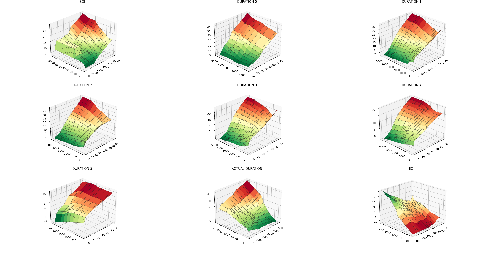

# edc15-eoi

This is a simple tool I created to be able to easily tell the precise time of
End of Injection event in PD TDI engines.



## Getting started

1. Download & install the latest version of Python from:
https://www.python.org/downloads/
 2. Download this repository as a zip and open
a console window in that directory
 3. Run `pip install -r requirements.txt` to
install the dependencies
 4. Run `py eoi.py` to test if the program's working

## Usage

Run the following commands to get started quickly:

```
 git clone https://github.com/krook1024/edc15-eoi.git
 cd edc15-eoi
 python
-m pip install -r requirements.txt
 py ./eoi.p -h
 ```

### Listing available codeblocks

Let's imagine we have a file called `current.bin`, in that case we can run
```sh
 py eoi.py -f current.bin -l
 ```
 to list the avaiable codeblocks. The
output will look something like this:
 ```sh
 Available codeblocks in current.bin
╭────────────────┬─────────┬─────────┬───────────────┬────────────────╮
│   CodeBlock ID │ Start   │ End     │ ID location   │ Gearbox type   │
├────────────────┼─────────┼─────────┼───────────────┼────────────────┤
│              2 │ 0x717ee │ 0x817ed │ 0x77a50       │ Manual         │
╰────────────────┴─────────┴─────────┴───────────────┴────────────────╯
```

### Showing actual duration & EOI

After finding out the codeblock ID, we can go ahead and run the program like
this:
 ```sh
 py eoi.py -f current.bin -c 2 
 ```
 and it will show all the
necessary maps and calculations. 

If you want to also show the tables in a graphical view, you can use
 ```sh
 py
eoi.py -f current.bin -c 2 -p
 ```

### Notes

The order of the arguments don't matter, as long as all required arguments are
set.