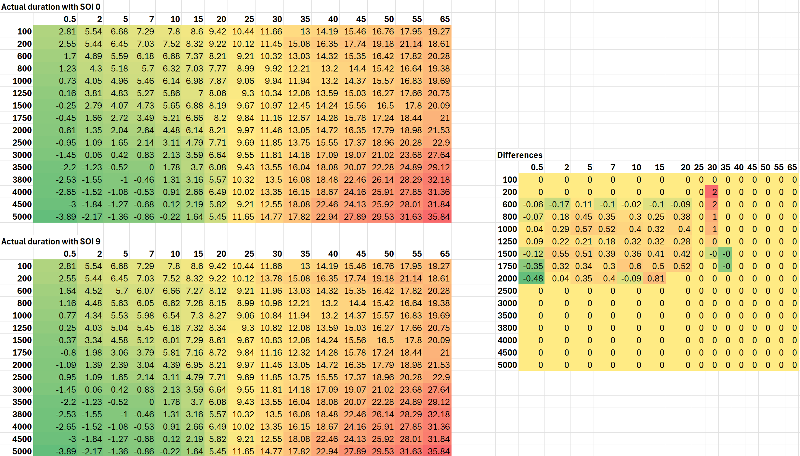

# edc15-eoi

This is a simple tool I created to be able to easily tell the precise time of
End of Injection event in PD TDI engines.


## Getting started

1. Download & install the latest version of Python from:
   https://www.python.org/downloads/
2. Download this repository as a zip and open
   a console window in that directory
3. Run `pip install -r requirements.txt` to
   install the dependencies
4. Run `py eoi.py` to test if the program's working

## Usage

Run the following commands to get started quickly:

```
git clone https://github.com/krook1024/edc15-eoi.git
cd edc15-eoi
python -m pip install -r requirements.txt
py ./eoi.py -h
```

### Listing available codeblocks

Let's imagine we have a file called `current.bin`, in that case we can run
```sh
py eoi.py -f current.bin -l
```
to list the avaiable codeblocks. The output will look something like this:
```sh
 Available codeblocks in current.bin
╭────────────────┬─────────┬─────────┬───────────────┬────────────────╮
│   CodeBlock ID │ Start   │ End     │ ID location   │ Gearbox type   │
├────────────────┼─────────┼─────────┼───────────────┼────────────────┤
│              2 │ 0x717ee │ 0x817ed │ 0x77a50       │ Manual         │
╰────────────────┴─────────┴─────────┴───────────────┴────────────────╯
```

### Showing actual duration & EOI

After finding out the codeblock ID, we can go ahead and run the program like
this:
```sh
py eoi.py -f current.bin -c 2 
```
and it will show all the necessary maps and calculations. 

If you want to also show the tables in a graphical view, you can use
```sh
py eoi.py -f current.bin -c 2 -p
```

### Notes

- You can run `py eoi.py -h` to print the documentation of each argument.
- The order of the arguments don't matter, as long as all required arguments
  are set.


## PD TDI on a single duration map

### Introduction

As we know, PD TDI engines with EDC15P Bosch ECU management use 6 different
duration maps labeled from 0 to 5. Later they use a mechanism to select the
appropriate one using the current start of injection, while also interpolating
between the different maps in a linear fashion. To understand this deeper,
let's take an example.

- Duration selector map:
  | Start of Injection | Map Index
  | ------------------ | ---------
  | 27                 | 0
  | 21                 | 1
  | 15                 | 2
  | 9                  | 3
  | 4                  | 4
  | 0                  | 5
- Required IQ: `50 mg/str`
- Current engine speed: `4000 rpm`
- ➞ Required SOI: `24°`
- ➞ Selected duration indexes: `1` and `0`
- ➞ Duration from map 0: `30.0°`
- ➞ Duration from map 1: `29.8°`
- ➞ **Final duration:** `(30.0° + 29.8°) / 2 = 29.9°`

As one can see, this is a simplified case, because there is a column for
`50 mg/str` and `4000 rpm` in the duration tables, had it not been so, say the
quantity were to be `48.72 mg/str` or the engine speed were to be `3882 rpm`, the ECU
would have had to interpolate inside the duration tables as well.

But even in this simplified case, there is a lot of calculation that is
completely unnecessary, because the final duration can be calculated in advance
for all combinations, because the required SOI is known at the time of creating
the software.

Even better, it is possible to do using this piece of software. We will now
proceed to an actual example using the following ECU content:
`Seat Ibiza Cupra 1.9 TDI 038906019MS 0281011852 370651 BPX 160`.

### Example

Run this script using the following command:

```sh
py eoi.py -c 2 -f "Seat Ibiza Cupra 1.9 TDI 038906019MS 0281011852 370651 BPX 160.bin" -s 9
```

to select the codeblock #2 and use the start of injection map #9 that would be
selected for a warm engine. In the script's output, the actual duration is 
calculated in a way that can be instantly be put in Duration #1, let's inspect
the output:

```
ACTUAL DURATION (Dura 1 axes)
      0.50   2.00   5.00   7.00   10.00  15.00  20.00  25.00  30.00  35.00  40.00  45.00  50.00  55.00  65.00
100    2.81   5.54   6.68   7.29   7.80   8.60   9.42  10.44  11.66  13.00  14.19  15.46  16.76  17.95  19.27
200    2.55   5.44   6.45   7.03   7.52   8.32   9.22  10.12  11.45  15.08  16.35  17.74  19.18  21.14  18.61
600    1.70   4.69   5.59   6.18   6.68   7.37   8.21   9.21  10.32  13.03  14.32  15.35  16.42  17.82  20.28
800    1.23   4.30   5.18   5.70   6.32   7.03   7.77   8.99   9.92  12.21  13.20  14.40  15.42  16.64  19.38
1000   0.73   4.05   4.96   5.46   6.14   6.98   7.87   9.06   9.94  11.94  13.20  14.37  15.57  16.83  19.69
1250   0.16   3.81   4.83   5.27   5.86   7.00   8.06   9.30  10.34  12.08  13.59  15.03  16.27  17.66  20.75
1500  -0.25   2.79   4.07   4.73   5.65   6.88   8.19   9.67  10.97  12.45  14.24  15.56  16.50  17.80  20.09
1750  -0.45   1.66   2.72   3.49   5.21   6.66   8.20   9.84  11.16  12.67  14.28  15.78  17.24  18.44  21.00
2000  -0.61   1.35   2.04   2.64   4.48   6.14   8.21   9.97  11.46  13.05  14.72  16.35  17.79  18.98  21.53
2500  -0.95   1.09   1.65   2.14   3.11   4.79   7.71   9.69  11.85  13.75  15.55  17.37  18.96  20.28  22.90
3000  -1.45   0.06   0.42   0.83   2.13   3.59   6.64   9.55  11.81  14.18  17.09  19.07  21.02  23.68  27.64
3500  -2.20  -1.23  -0.52   0.00   1.78   3.70   6.08   9.43  13.55  16.04  18.08  20.07  22.28  24.89  29.12
3800  -2.53  -1.55  -1.00  -0.46   1.31   3.16   5.57  10.32  13.50  16.08  18.48  22.46  26.14  28.29  32.18
4000  -2.65  -1.52  -1.08  -0.53   0.91   2.66   6.49  10.02  13.35  16.15  18.67  24.16  25.91  27.85  31.36
4500  -3.00  -1.84  -1.27  -0.68   0.12   2.19   5.82   9.21  12.55  18.08  22.46  24.13  25.92  28.01  31.84
5000  -3.89  -2.17  -1.36  -0.86  -0.22   1.64   5.45  11.65  14.77  17.82  22.94  27.89  29.53  31.63  35.84
```

This is exactly what the ECU would've calculated for required duration given
the rpm/quantity pairs. 

### Moving to a single duration map

After we have the actual duration map that the ECU would've calculated, we can
go ahead and paste the output into Excel, and then into WinOLS. The only
thing left to do is to alter the duration selector map in the following manner:

```
SELECTOR
25.01 | 1
19.99 | 1
15.00 | 1
10.01 | 1
4.99  | 1
0.00  | 1
```

so for any SOI, Duration #1 is selected.

### Motivation

Why go through all this hassle, you might ask? My reason is simplicity. If you
think back to how MSA15 / EDC15V operates, there is a single pump voltage map
that is responsible for mapping fuel quantities to quantity adjuster voltages.
This simple nature allows you to precisely control fueling even after installing
larger aftermarket nozzles. In my experience, you can do this to a bone stock
car, and it will continue to run without any noticeable changes.

Another reason is this approach makes tuning End of Injection very simple,
whether you do it because you're tuning for economy, or because you installed
highly oversized nozzles and want to be as precise as possible.

### Caveat

There is one caveat with this approach, which is the fact that start of
injection is not constant under different environmental conditions. Factors that
influence SOI apart from the SOI map are mainly: coolant temperature,
atmospheric pressure and intake temperature. This is a valid point and there is
no way to account for these changes when tuning EDC15P software. However, with
factory duration maps, the change in duration with the change of SOI is pretty
negligible. 



Above is an Excel sheet that shows the difference in actual duration if we
select SOI #0 vs. SOI #9. As you can see, the difference is under 2 degrees,
but for the most part, they are under 0.5 degrees. In my experience, this does
not alter engine behavior, and the gain in simplicity easily outweighs this
caveat.